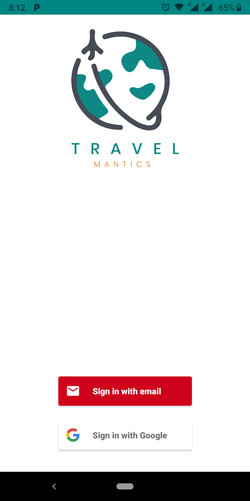
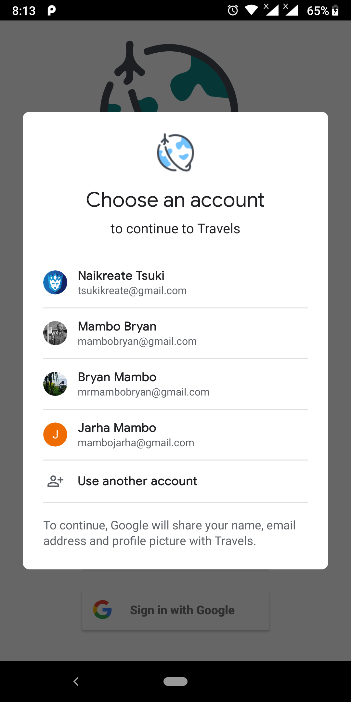
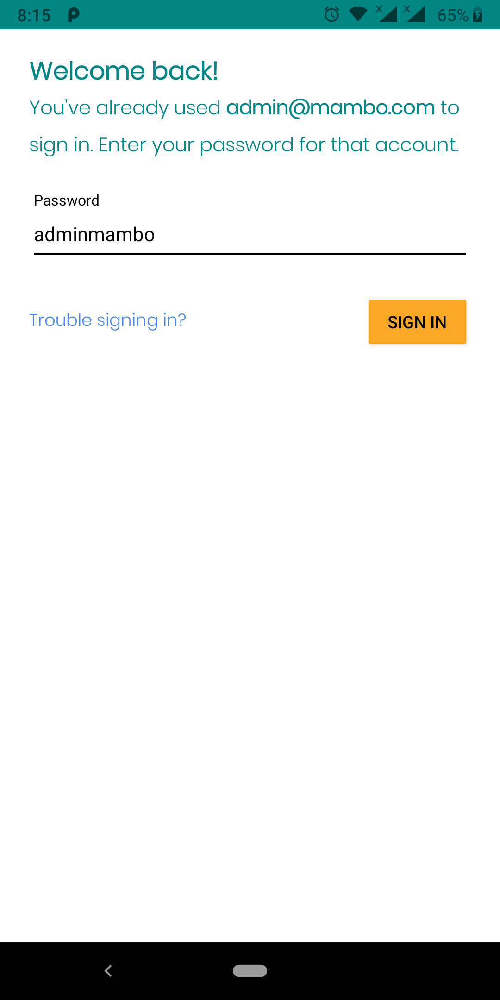
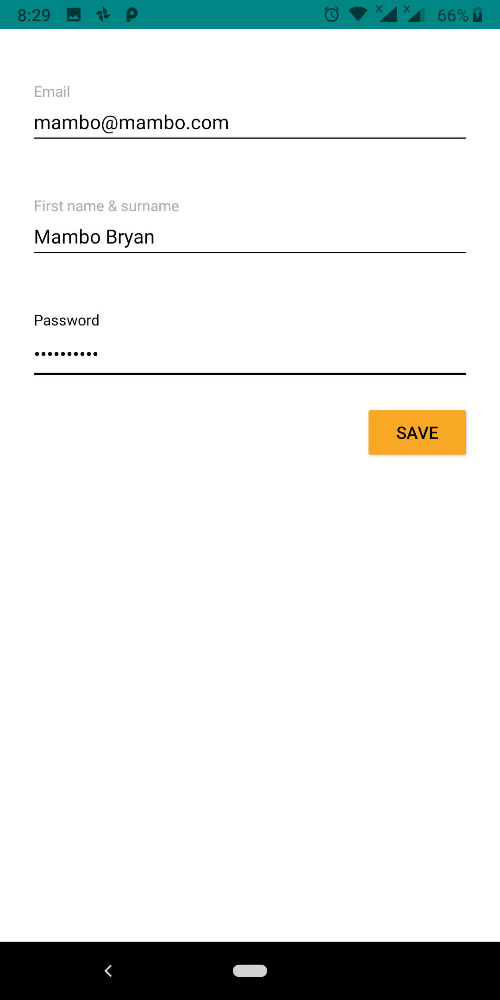
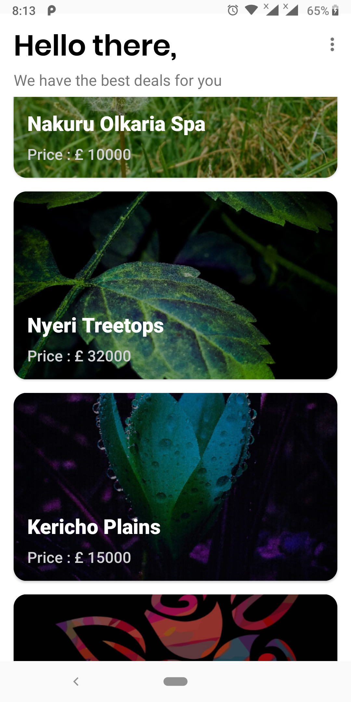
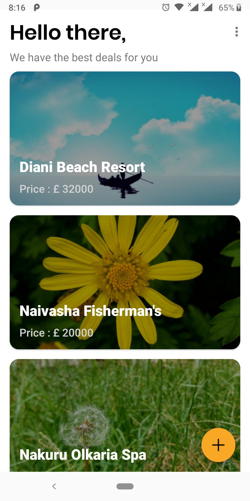
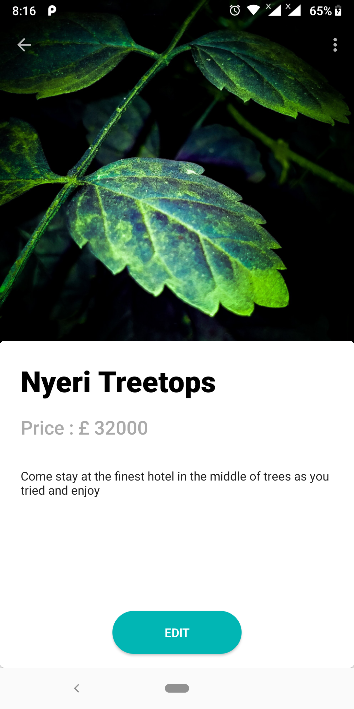
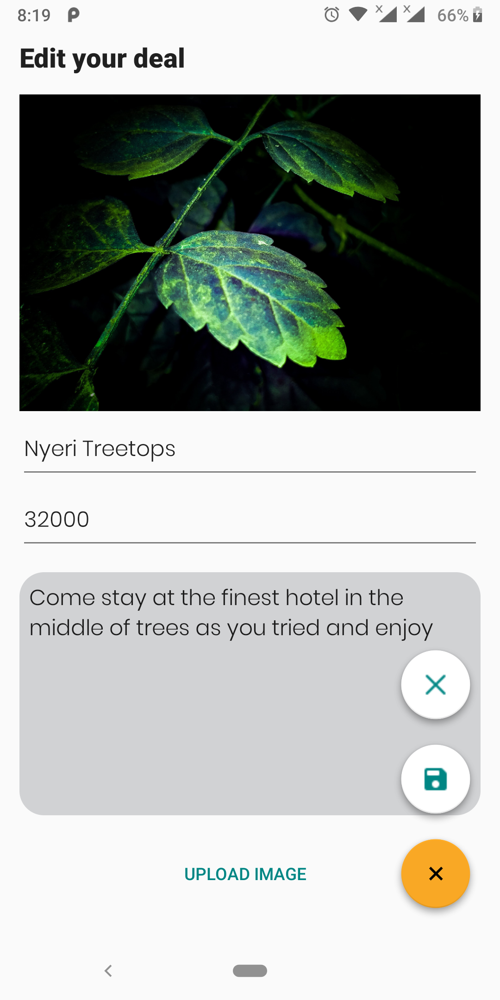

# Travelmantics
   

Travelmantics is a simple app that helps users find the best travel deals within their location.

This app uses firebase as its backend and can do the following:
- Users can login/signup and view all the current deals and share with their friends.
- Admins can login/signup with admin privileges, they can see, add, update and delete new travel deals.

I have used the following components for development:
- FirebaseUI
- Constraint Layout
- RecyclerView

###### For app demo [click here](https://appetize.io/app/d0a5dbrjgxdhb5hy8t1tzt0qum?device=nexus5&scale=75&orientation=portrait&osVersion=8.1)
###### For final app apk [click here](https://drive.google.com/open?id=1jn339O3c6l9jyo1NCQSA0bQDib0sorDu) to download

## Prerequisites
You will need the following to run this project:
1. A machine with internet access (Laptop or desktop)
2. Android studio 3.4 or later

## Set up
* Clone the project repository
* Open the project folder using Android Studio IDE
* Wait to for build to finish and you're good to go

## App Usage
#### Login/Signup
Users can login/signup to the app with their google account or email.

	  

#### Travel Deals List
Users can view a list of travel deals while for admins have the option of adding new deals.

 

#### Travel Deal
Users can view a specific travel deal and share it by mail while an admin can edit the travel deal.

 

#### Updating travel deals
An admin can create and save a new travel deal or update and delete an existing travel deal.

## Contributions
Find any typos? Have another resource you think should be included? Contributions are welcome!
* First, fork this repository
* Next, clone this repository to your desktop/laptop to make changes by

		` $ git clone {YOUR_REPOSITORY_CLONE_URL}`
		` $ cd Travelmantics`

* Once you've pushed changes to your local repository, you can issue a pull request by clicking on the green pull request icon.
